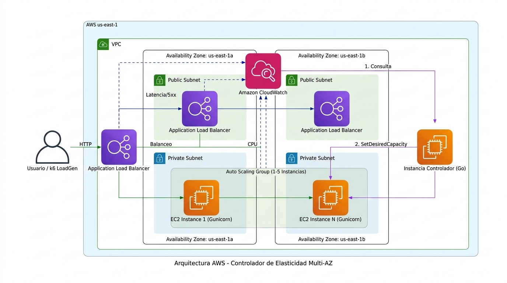

# Controlador de Elasticidad Horizontal

## 1. Resumen Ejecutivo

Se diseñó e implementó un controlador de elasticidad horizontal independiente escrito en Go. Este controlador reemplaza las políticas de escalado nativas de AWS (Dynamic Scaling), operando bajo un bucle de control continuo (cada 30 segundos) que lee métricas de **CloudWatch** y ajusta directamente el número de instancias EC2 en un **Auto Scaling Group** para una aplicación web (Gunicorn/Python).

El controlador decide entre tres acciones: `MAINTAIN_CAPACITY`, `INCREASE_CAPACITY`, y `REDUCE_CAPACITY`, garantizando estabilidad, protección contra oscilaciones (*thrashing*), y escalado proactivo mediante regresión lineal sobre el incremento de la demanda.

## 2. Arquitectura AWS



### Componentes Clave:
*   **k6 LoadGen:** Inyecta tráfico simulando usuarios reales con perfiles específicos (rampa, step, etc.).
*   **Application Load Balancer (ALB):** Balancea la carga y reporta los errores de aplicación (5xx) y la latencia.
*   **Auto Scaling Group (ASG):** Configurado como **solo actuador** (Min: 1, Max: 5, Cero políticas de escalado).
*   **Instancias EC2:** Aplicación Python Gunicorn (4 workers) para maximizar la métrica real de CPU evadiendo el GIL de Python.
*   **Controlador Go:** Instancia EC2 aislada que corre el binario compilado. Revisa métricas, evalúa 8 guardas de seguridad/negocio y decide.

---

## 3. Instrucciones para Ejecutar el Proyecto

### Requisitos Previos
- **AWS CLI** configurado con credenciales (`aws configure`).
- **k6** instalado localmente (`k6 run`).
- **Go** instalado (≥ 1.20) para compilar el controlador.
- Tu par de claves SSH (`.pem`) cargado en tu carpeta `~/.ssh/`.

### Paso 1: Despliegue de Infraestructura
Toda la infraestructura (VPC, ALB, ASG, EC2, IAM, Security Groups) debe desplegarse en AWS. 
**Sigue las instrucciones detalladas paso a paso en el archivo [`docs/despliegue_aws.md`](docs/despliegue_aws.md) para configurar todo en la consola web de AWS.**

### Paso 2: Desplegar el Controlador (AMI)
Una vez configurada la infraestructura base y obtenidos los IDs reales (ARN del Target Group y sufijos del ALB/TG en `config/config.yaml`), el despliegue formal del controlador se realiza **horneando una AMI**:
```bash
./scripts/bake_ami.sh <tu_key_name> <sg-id> <subnet-id> LabInstanceProfile
```
Esta AMI contiene el binario compilado y el servicio `systemd` configurado. Al lanzar la instancia EC2 final del controlador desde la consola web, simplemente selecciona la AMI generada.

*Nota para desarrollo:* Si estás haciendo cambios frecuentes al código, puedes usar `./scripts/deploy.sh ec2-user@<IP> ~/.ssh/tu-clave.pem` para subir el binario en caliente sin tener que hornear una nueva AMI cada vez.

### Paso 3: Correr un Experimento
El script automatizado arranca el loadgen (k6), orquesta el ciclo de vida del controlador, y colecta las gráficas de resultados.

Sintaxis:
```bash
./scripts/run_experiment.sh <EXP_ID> <RUN_ID> ec2-user@<IP_CONTROLADOR> <ALB_DNS> ~/.ssh/tu-clave.pem
```

Ejemplo para el experimento **E2 (Rampa Ascendente)**:
```bash
./scripts/run_experiment.sh E2 03 ec2-user@<IP_CONTROLADOR> <ALB_DNS> ~/.ssh/tu-clave.pem
```

Al finalizar los 12 minutos, los resultados, el archivo de decisiones `decisions.jsonl` y las gráficas generadas con Python se guardarán localmente en `results/E2/run03/`.

---

## 4. La Política de Decisión (Cascada)

La inteligencia del controlador reside en `cmd/controller/policy.go`. Las decisiones se evalúan en una **cascada determinista**. Las guardas de seguridad se evalúan primero:

| # | Condición | Decisión (Razón) |
|---|---|---|
| 1 | Datos insuficientes, viejos o caídas de AWS | `MAINTAIN (DATA_INSUFFICIENT)` |
| 2 | Instancias arrancando o en apagado | `MAINTAIN (CAPACITY_UNSTABLE)` |
| 3 | Cooldown temporal activo (45s) | `MAINTAIN (COOLDOWN)` |
| 4 | Instancias degradadas (*Healthy < Desired*) | `INCREASE (UNHEALTHY_ESTABLISHED)` |
| 5 | Tasa de Errores > 5% (Firma de backlog lleno) | `INCREASE (HIGH_ERROR_RATE)` |
| 6 | Tendencia RPS proyectada alza severa | `INCREASE (PROACTIVE_RPS_TREND)` |
| 7 | CPU > `u_high` en 3 de 4 ventanas de tiempo | `INCREASE (SUSTAINED_HIGH)` |
| 8 | CPU < `u_low` unánime **y** reducción segura | `REDUCE (SUSTAINED_LOW)` |
| 9 | Ninguna de las anteriores | `MAINTAIN (WITHIN_BAND)` |

*Nota:* Reducir es seguro si la proyección matemática `CPU * (N / (N-1))` no cruza la barrera `u_high`, y si la latencia no está degradada. Esto previene un ciclo de *thrashing* (subir y bajar repetidamente).