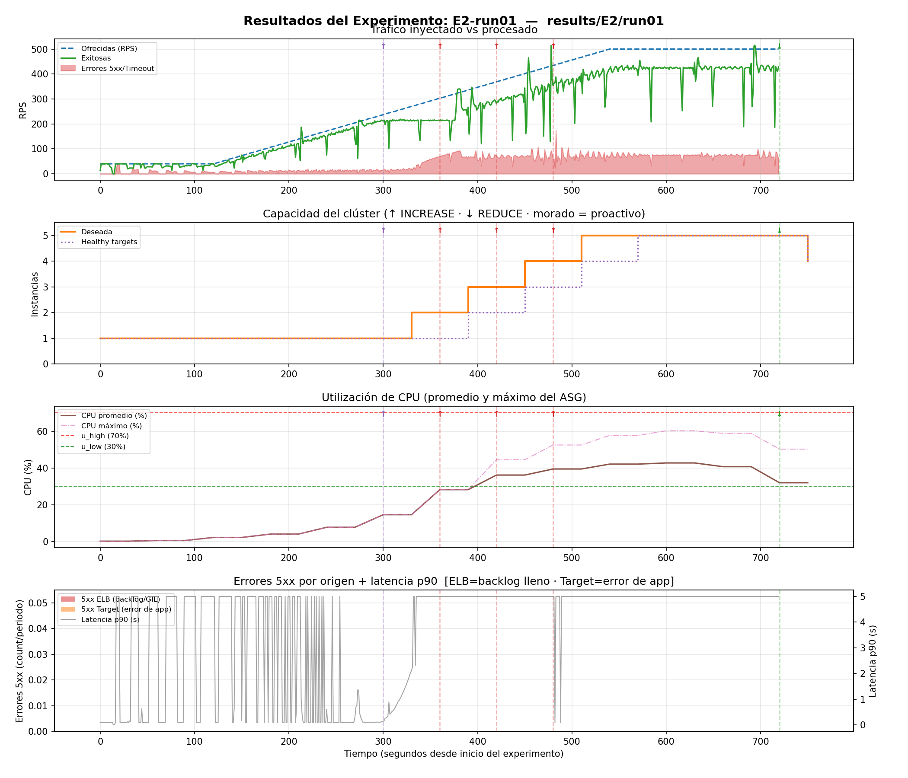
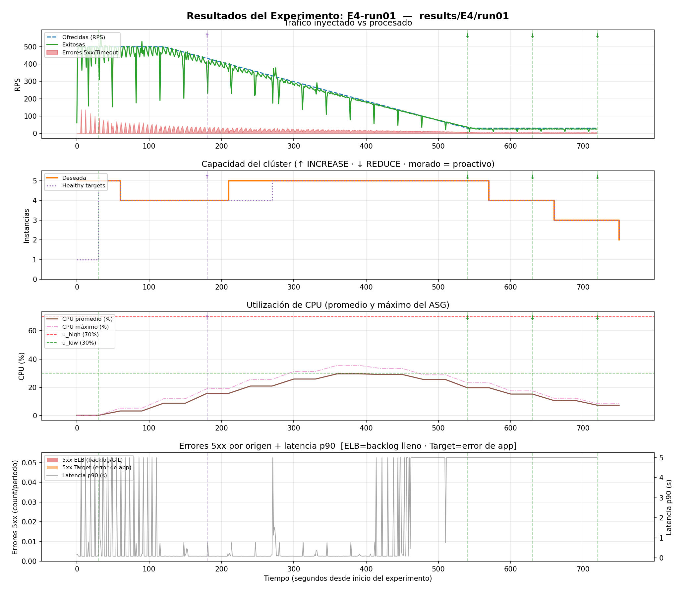
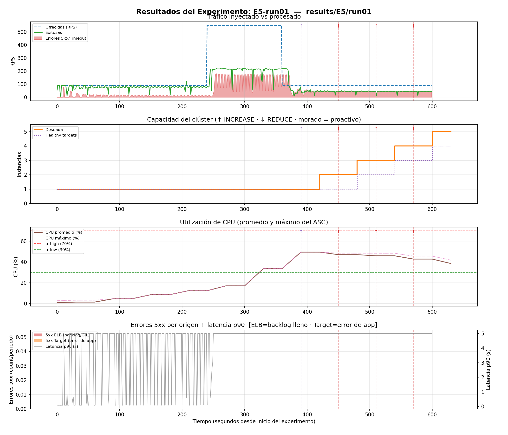
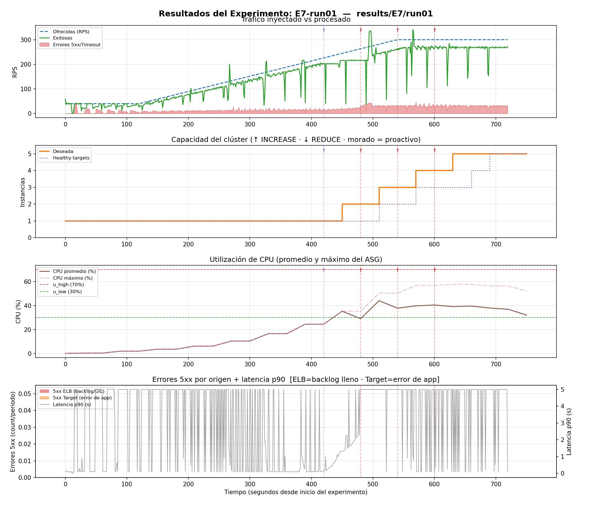

# Resultados Experimentales — Controlador de Elasticidad Horizontal

---

## Cómo leer las gráficas

Cada experimento tiene 4 paneles:

| Panel                    | Qué muestra                                                          |
| ------------------------ | -------------------------------------------------------------------- |
| **① Tráfico**            | RPS ofrecidas, RPS exitosas y errores 5xx.                           |
| **② Capacidad**          | `DesiredCapacity` y targets saludables.                              |
| **③ CPU**                | CPU promedio y máxima del ASG frente a `u_high=70 %` y `u_low=30 %`. |
| **④ Errores + Latencia** | Errores 5xx del ELB/Target y latencia p90.                           |

Las líneas verticales indican acciones del controlador:

* 🟣 `PROACTIVE_RPS_TREND`: escalado según tendencia OLS.
* 🔴 `INCREASE_CAPACITY`: scale-out.
* 🟢 `REDUCE_CAPACITY`: scale-in.

---

# Experimento E2 — Rampa Ascendente (40 → 500 RPS)

**Perfil:** La carga aumenta de 40 a 500 RPS durante 720 s.
**Objetivo:** Probar el scale-out progresivo.

### Análisis





El tráfico exitoso sigue al tráfico ofrecido hasta aproximadamente `t=300 s`. Después empiezan a aparecer errores 5xx y la diferencia entre ambos aumenta hasta el final.

El controlador escala progresivamente:

**1 → 2 → 3 → 4 → 5 instancias**

Existe un retraso de aproximadamente **60–90 s por instancia** entre `DesiredCapacity` y `Healthy`, debido al arranque de EC2 y los health checks del ALB.

La CPU solo llega aproximadamente al **35–40 %**, por debajo de `u_high=70 %`. Esto indica que el principal problema no es la CPU, sino la **concurrencia**: los 4 workers de Gunicorn se saturan por las conexiones antes de utilizar completamente la CPU.

Los errores 5xx del ELB aparecen desde aproximadamente `t=100 s`, antes del escalado. Esto indica que el cuello de botella está en el **backlog del socket (128 conexiones)**. Cuando se llena, aparecen errores y la latencia p90 llega a unos **5 s**.

### Hallazgos

| Métrica              | Resultado |
| -------------------- | --------- |
| Primer `INCREASE`    | ~300 s    |
| Instancias finales   | 5         |
| CPU máxima promedio  | ~40 %     |
| Capacidad aproximada | ~250 RPS  |
| Demanda final        | 500 RPS   |
| Déficit              | ~250 RPS  |

**Conclusión:** El controlador llegó al máximo de capacidad permitido. Los errores restantes se explican porque `max_capacity=5` permite unas 250 RPS, mientras la demanda llegó a 500 RPS.

---

# Experimento E4 — Rampa Descendente (500 → 30 RPS)

**Perfil:** La carga disminuye de 500 a 30 RPS durante 720 s.
**Objetivo:** Comprobar un scale-in seguro y evitar thrashing.

### Análisis



El experimento comienza con 5 instancias y una carga alta. Al principio aparecen errores, pero estos disminuyen cuando la demanda baja de aproximadamente 250 RPS.

El controlador reduce gradualmente la capacidad:

**5 → 4 → 3 instancias**

Existe un intento de reducción temprana, pero `safeToReduce()` evita que se quite capacidad cuando todavía no es seguro.

La CPU se mantiene aproximadamente entre 20–30 % y, cuando permanece por debajo de `u_low=30 %`, se activa `SUSTAINED_LOW` y se permite el scale-in.

Los errores 5xx y la latencia también disminuyen con la carga hasta estabilizarse.

### Hallazgos

| Métrica             | Resultado       |
| ------------------- | --------------- |
| Reducciones         | 3 (5 → 4 → 3)   |
| Estabilización      | ~t=400 s        |
| Trigger de scale-in | `SUSTAINED_LOW` |
| Thrashing           | No              |

**Conclusión:** El controlador realizó el scale-in de manera gradual y segura. `safeToReduce()` evitó reducir capacidad demasiado pronto y provocar un nuevo scale-out.

---

# Experimento E5 — Pico Transitorio (90 → 550 → 90 RPS)

**Perfil:** La carga pasa de 90 a 550 RPS durante unos 130 s y después vuelve a 90 RPS.
**Objetivo:** Analizar las limitaciones del escalado frente a picos rápidos.

### Análisis



Cuando la carga sube a 550 RPS, el sistema solo consigue procesar aproximadamente **200 RPS**, es decir, cerca del **37 % de la demanda**. Durante prácticamente todo el pico aparecen errores 5xx y la latencia llega a unos 5 s.

Lo más importante es que el controlador permanece en **1 instancia durante el pico**. Para activar `SUSTAINED_HIGH` necesita 3 muestras de 60 s, por lo que el pico termina antes de que pueda reaccionar.

Después del pico, el controlador aumenta la capacidad:

**1 → 2 → 3 → 4 → 5**

Pero para ese momento la carga ya volvió a 90 RPS, por lo que termina con 5 instancias para una demanda baja.

La CPU tampoco supera el 70 %. El problema vuelve a ser la concurrencia y el backlog, por lo que el trigger principal termina siendo `UNHEALTHY_ESTABLISHED`.

### ¿Por qué OLS no evitó el retraso?

Antes del pico, las muestras son aproximadamente:

`[90, 90, 90, 90]`

La pendiente OLS es prácticamente 0, así que no existe una tendencia que permita anticipar el aumento.

Después del salto, CloudWatch necesita tiempo para publicar las nuevas muestras y OLS necesita al menos 3 muestras válidas. Cuando finalmente detecta la tendencia, el pico ya está terminando.

| Perfil  | Resultado de OLS                                |
| ------- | ----------------------------------------------- |
| E2 / E7 | Ayuda porque el crecimiento es gradual          |
| E5      | No ayuda a tiempo porque el pico es instantáneo |

### Hallazgos

| Métrica                    | Resultado                            |
| -------------------------- | ------------------------------------ |
| Duración del pico          | ~130 s                               |
| Tiempo mínimo de detección | ~180 s                               |
| RPS procesados             | ~200 de 550                          |
| Capacidad final            | 5 instancias                         |
| Trigger                    | `UNHEALTHY_ESTABLISHED` / OLS tardío |

**Conclusión:** El pico fue demasiado rápido para que el controlador pudiera reaccionar. Para este tipo de tráfico serían necesarias soluciones como **Warm Pools**, escalado predictivo o arquitecturas **Serverless/FaaS**.

---

# Experimento E7 — Rampa con Resiliencia (40 → 300 RPS)

**Perfil:** La carga aumenta de 40 a 300 RPS durante 720 s.
**Objetivo:** Comprobar la estabilidad con una carga creciente pero manejable.

### Análisis




La carga aumenta gradualmente y el controlador escala:

**1 → 2 → 3 → 4 → 5 instancias**

Durante la transición aparecen algunos errores, pero cuando las nuevas instancias están disponibles, el tráfico exitoso vuelve a acercarse al ofrecido y los errores casi desaparecen.

La CPU llega aproximadamente al **40–45 %**, pero nunca supera el 70 %. Cuando las 5 instancias están saludables, baja a aproximadamente 25–30 %.

La latencia p90 aumenta durante el escalado hasta unos 2–3 s, pero después vuelve a valores bajos. En la fase final se mantiene aproximadamente entre **0.1–0.2 s**, dentro del SLO de `<0.6 s`.

### Hallazgos

| Métrica              | Resultado  |
| -------------------- | ---------- |
| Instancias finales   | 5          |
| RPS sin errores      | ~290 RPS   |
| CPU máxima           | ~45 %      |
| Latencia p90 estable | ~0.1–0.2 s |
| Thrashing            | No         |

**Conclusión:** El controlador logró estabilizar el sistema porque la carga aumentó de forma gradual. Esto le dio tiempo para crear las instancias antes de que la demanda superara la capacidad disponible.

---

# Comparativa General

| Experimento | Perfil           |  RPS Máx | Instancias finales | Errores                  | Trigger principal                               |
| ----------- | ---------------- | -------: | -----------------: | ------------------------ | ----------------------------------------------- |
| **E2**      | Rampa ↑          |      500 |                  5 | Sí, ~50 % pérdida        | `UNHEALTHY_ESTABLISHED` + `HIGH_ERROR_RATE`     |
| **E4**      | Rampa ↓          | 500 → 30 |                  3 | Solo al inicio           | `SUSTAINED_LOW`                                 |
| **E5**      | Pico             |      550 |                  5 | Sí, durante el pico      | `UNHEALTHY_ESTABLISHED`                         |
| **E7**      | Rampa ↑ moderada |      300 |                  5 | Leves durante transición | `PROACTIVE_RPS_TREND` + `UNHEALTHY_ESTABLISHED` |

---

# ¿Por qué la CPU nunca llegó al 70 %?

En todos los experimentos la CPU promedio estuvo aproximadamente entre **25–50 %**. Esto ocurre porque el cuello de botella principal no está en la CPU, sino en la cantidad de conexiones que los workers pueden procesar.

```text
4 workers Gunicorn
        ↓
Conexiones simultáneas limitadas
        ↓
Backlog del socket (128)
        ↓
Backlog lleno
        ↓
Errores 5xx / 502 del ALB
        ↓
CPU todavía alrededor de ~40 %
```

Por eso el controlador utiliza también `UNHEALTHY_ESTABLISHED` y `HIGH_ERROR_RATE` para detectar problemas, en lugar de depender únicamente de la CPU.

---

# Límite físico del clúster

```text
1 instancia ≈ 50 RPS

5 instancias ≈ 250 RPS

E2: 500 RPS → déficit ≈ 250 RPS

E5: 550 RPS → déficit ≈ 300 RPS

E7: 300 RPS → déficit ≈ 50 RPS

E4: 30 RPS → capacidad sobrante
```

## Conclusión general

Los experimentos muestran que el comportamiento del controlador depende mucho del **tipo de carga**.

En las rampas graduales, como E2 y E7, el controlador tiene tiempo para detectar la tendencia y aumentar la capacidad. En E4 puede reducirla de manera segura cuando la demanda disminuye.

En cambio, E5 demuestra que un pico repentino puede ser demasiado rápido para el mecanismo de detección y para el tiempo de arranque de EC2.

Además, los resultados muestran que el principal cuello de botella no es la CPU, sino la **concurrencia de los workers y el backlog del socket**. Finalmente, `max_capacity=5` establece un límite físico de aproximadamente **250 RPS**, por lo que cuando la demanda supera ese valor el controlador no puede solucionar el déficit simplemente escalando.
